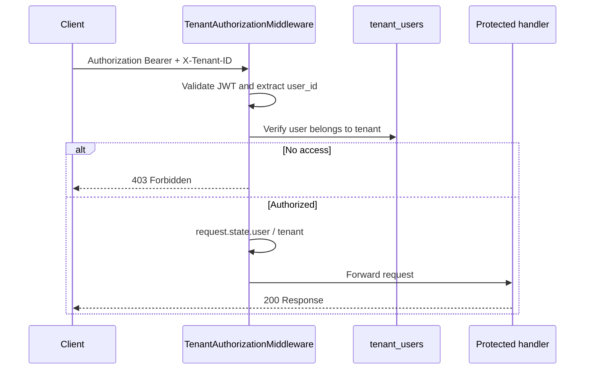

# Multi-Tenant Authorization

Protected APIs require **JWT authentication** and an **`X-Tenant-ID` header**. The server verifies membership in `tenant_users` and never trusts a tenant id from the request body or query string.

## Flow



## Public routes (no tenant middleware)

- `/auth/*`
- `/api/v1/health`
- `/docs`, `/redoc`, `/openapi.json`

## JWT-only routes (no `X-Tenant-ID`)

- `GET /me/context` — tenant resolved from JWT `tenant_id` claim only

## Headers

| Header | Required | Description |
|--------|----------|-------------|
| `Authorization` | Yes | `Bearer <access_token>` |
| `X-Tenant-ID` | Yes (protected routes) | UUID of the PG business tenant |

## Example: login then call protected API

```http
POST /auth/login
Content-Type: application/json

{
  "email": "owner@example.com",
  "password": "password123"
}
```

Response includes `access_token` and `tenant_id`.

```http
GET /api/v1/examples/tenant-scope
Authorization: Bearer <access_token>
X-Tenant-ID: <tenant_id>
```

```json
{
  "message": "Authorized for tenant-scoped access",
  "user_id": "...",
  "user_email": "owner@example.com",
  "tenant_id": "...",
  "tenant_name": "Demo PG"
}
```

## FastAPI dependency injection

Use injected dependencies on any protected route:

```python
from app.api.deps import CurrentTenant, CurrentUser, CurrentMembership

@router.get("/flats")
async def list_flats(
    user: CurrentUser,
    tenant: CurrentTenant,
    membership: CurrentMembership,
):
    ...
```

Available dependencies:

| Dependency | Type | Source |
|------------|------|--------|
| `CurrentUser` | `User` | JWT `sub` + DB |
| `CurrentTenant` | `Tenant` | `X-Tenant-ID` + `tenant_users` |
| `CurrentMembership` | `TenantUser` | `tenant_users` row |
| `CurrentUserId` | `UUID` | JWT `sub` |
| `CurrentTenantId` | `UUID` | `X-Tenant-ID` |
| `AuthorizedContextDep` | `AuthorizedContext` | Full auth context |

## Error responses

| Situation | Status | `error_code` |
|-----------|--------|--------------|
| Missing / invalid JWT | 401 | `unauthorized` |
| Missing `X-Tenant-ID` | 403 | `forbidden` |
| User not in tenant | 403 | `forbidden` |
| Inactive user / tenant | 403 | `forbidden` |

```json
{
  "detail": "User does not have access to this tenant",
  "error_code": "forbidden"
}
```

## Implementing a new protected route

1. Add the route under `/api/v1/...` (not under `/auth`).
2. Inject `CurrentUser` and `CurrentTenant` (or `AuthorizedContextDep`).
3. Ensure clients send both `Authorization` and `X-Tenant-ID`.
4. Use `tenant.id` for all tenant-scoped queries — never read tenant id from the body.

Example route: [`app/api/v1/examples.py`](../app/api/v1/examples.py)
