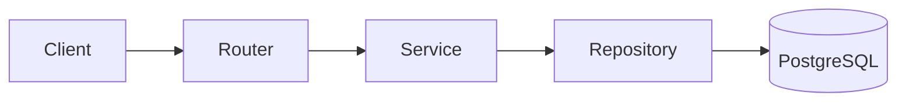
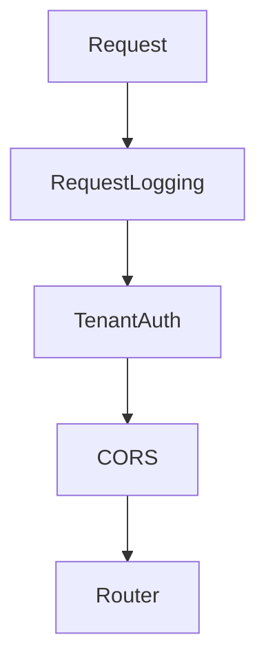
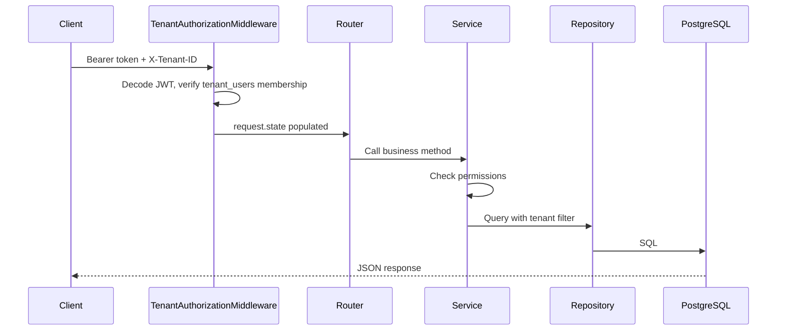

# Architecture

## Overview

The PG Management backend is a multi-tenant REST API for managing PG (paying guest) businesses. It follows a strict layered design:



**Rule:** Data always flows through all four layers. Routers never query the database directly.

## Tech stack

| Layer | Technology |
|-------|------------|
| API | FastAPI |
| Language | Python 3.12 |
| Database | PostgreSQL (async via asyncpg) |
| ORM | SQLAlchemy 2.0 (async) |
| Migrations | Alembic |
| Validation | Pydantic v2 |
| Auth | JWT (access + refresh tokens) |

## Folder structure

```
app/
├── api/            # HTTP routers and route-level dependencies
│   └── v1/         # Versioned API endpoints
├── core/           # Settings, security, exceptions, shared deps
├── db/             # SQLAlchemy base, session factory
├── middleware/     # Request logging, tenant auth, context
├── models/         # SQLAlchemy ORM entities
├── repositories/   # Database queries only
├── schemas/        # Pydantic request/response models
└── services/       # Business logic and permission checks
alembic/            # Database migrations
tests/              # pytest suite
docs/               # This documentation
```

## Layer responsibilities

### Routers (`app/api/`)

- Validate HTTP input via Pydantic schemas
- Call exactly one service method
- Return response schemas
- No business logic, no SQL

### Services (`app/services/`)

- Business rules and validation
- Permission checks (RBAC)
- Call repositories
- Commit transactions
- Raise domain exceptions (`NotFoundError`, `ForbiddenError`, etc.)

### Repositories (`app/repositories/`)

- SQLAlchemy 2.0 `select()` queries
- Tenant filtering via `BaseRepository`
- No business logic

### Models (`app/models/`)

- ORM table definitions
- Relationships and enums

### Schemas (`app/schemas/`)

- API request and response shapes
- Separate from ORM models — never return ORM objects from routes

## Application bootstrap

Entry point: [`app/main.py`](../app/main.py)

On startup (`lifespan`):

1. Load and validate settings from environment
2. Configure logging
3. Connect to PostgreSQL and verify connectivity
4. Register exception handlers

On shutdown: dispose the database engine.

## Middleware stack

Middleware runs in this order (last added runs first on incoming requests):



| Middleware | Purpose |
|------------|---------|
| `RequestLoggingMiddleware` | Assigns `X-Request-ID`, logs request timing |
| `TenantAuthorizationMiddleware` | Validates JWT + tenant membership on protected routes |
| `CORSMiddleware` | Allows configured frontend origins |

## Router mounts

| Prefix | Router | Auth required |
|--------|--------|---------------|
| `/auth` | Auth (signup, login, refresh, logout) | No |
| `/me` | Current user context | JWT only |
| `/api/v1` | Health, domain CRUD, examples | JWT + `X-Tenant-ID` |

## Request lifecycle (protected route)



## Route classification

Defined in [`app/core/paths.py`](../app/core/paths.py):

| Type | Examples | Requirements |
|------|----------|--------------|
| Public | `/auth/*`, `/api/v1/health`, `/docs` | None |
| JWT-only | `GET /me/context` | Bearer token; tenant from JWT claim |
| Tenant-protected | `/api/v1/flats`, `/api/v1/rooms`, etc. | Bearer token + `X-Tenant-ID` header |

## Error handling

All business errors use custom exceptions in [`app/core/exceptions.py`](../app/core/exceptions.py). Global handlers convert them to JSON:

```json
{ "detail": "Human-readable message", "error_code": "not_found" }
```

Stack traces are never sent to clients. Unexpected errors are logged and return `500`.

## Testing layout

```
tests/
├── conftest.py          # Shared fixtures (mock DB, AsyncClient)
├── api/                 # HTTP endpoint tests
├── middleware/          # Middleware behavior tests
└── services/            # Unit tests for business logic
```

Run all tests:

```powershell
pytest
```

See [API_CONVENTIONS.md](API_CONVENTIONS.md) for endpoint details and [TENANCY.md](TENANCY.md) for multi-tenant rules.
