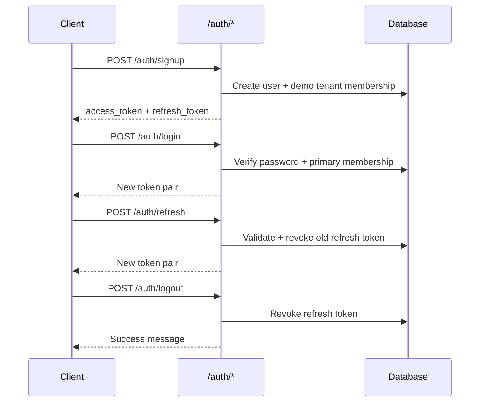

# Authentication

Authentication uses **JWT access tokens** and **refresh tokens**. Passwords are hashed with bcrypt and never stored in plain text.

## Endpoints

| Method | Path | Description |
|--------|------|-------------|
| POST | `/auth/signup` | Register a new user |
| POST | `/auth/login` | Log in with email and password |
| POST | `/auth/refresh` | Get a new token pair using a refresh token |
| POST | `/auth/logout` | Revoke a refresh token |

All auth routes are **public** — no `Authorization` header required.

## Signup flow

1. Client sends `full_name`, `email`, `password`
2. Server checks email is not already registered
3. Server creates the user with a bcrypt-hashed password
4. Server gets or creates the **demo tenant** (slug from `DEMO_TENANT_SLUG`, default `"demo"`)
5. Server links the user to the demo tenant as **Owner** with `is_primary=true`
6. Server issues access + refresh tokens and returns them

New users always start on the demo PG business. Production tenant onboarding will be added later.

## Login flow

1. Client sends `email`, `password`
2. Server verifies credentials and user is active
3. Server loads the user's **primary** tenant membership (`is_primary=true`)
4. Server issues a new token pair for that tenant

## Token response shape

```json
{
  "access_token": "eyJ...",
  "refresh_token": "eyJ...",
  "token_type": "bearer",
  "expires_in": 3600,
  "user": {
    "id": "uuid",
    "email": "owner@example.com",
    "full_name": "Owner Name"
  },
  "tenant_id": "uuid"
}
```

## Access token (JWT)

| Claim | Meaning |
|-------|---------|
| `sub` | User ID |
| `tenant_id` | Active PG business ID |
| `type` | `"access"` |
| `exp` | Expiry timestamp |
| `iat` | Issued-at timestamp |

Configured via `ACCESS_TOKEN_EXPIRE_MINUTES` (default 60).

## Refresh token

| Claim | Meaning |
|-------|---------|
| `sub` | User ID |
| `jti` | Refresh token row ID (UUID) |
| `type` | `"refresh"` |
| `exp` | Expiry timestamp |

- Stored **hashed** in the `refresh_tokens` table (never plain text in DB)
- Lifetime configured via `REFRESH_TOKEN_EXPIRE_DAYS` (default 7)
- On refresh: old token is revoked, new pair is issued (rotation)
- On logout: refresh token is revoked

## Full auth sequence



## Refresh request

```http
POST /auth/refresh
Content-Type: application/json

{ "refresh_token": "eyJ..." }
```

## Logout request

```http
POST /auth/logout
Content-Type: application/json

{ "refresh_token": "eyJ..." }
```

## Security rules

- Never log passwords or tokens
- Never store plain passwords — use `hash_password()` / `verify_password()` from [`app/core/security.py`](../app/core/security.py)
- Invalid or expired tokens return `401` with `error_code: "unauthorized"`
- Inactive users return `403` with `error_code: "forbidden"`

## Environment variables

| Variable | Required | Default | Purpose |
|----------|----------|---------|---------|
| `JWT_SECRET_KEY` | Yes | — | Signing key (min 32 chars) |
| `JWT_ALGORITHM` | Yes | — | `HS256`, `HS384`, or `HS512` |
| `ACCESS_TOKEN_EXPIRE_MINUTES` | Yes | — | Access token TTL |
| `REFRESH_TOKEN_EXPIRE_DAYS` | No | `7` | Refresh token TTL |
| `DEMO_TENANT_SLUG` | No | `demo` | Demo tenant slug for signup |

See [AUTHORIZATION_EXAMPLES.md](AUTHORIZATION_EXAMPLES.md) for how to use tokens on protected routes.
