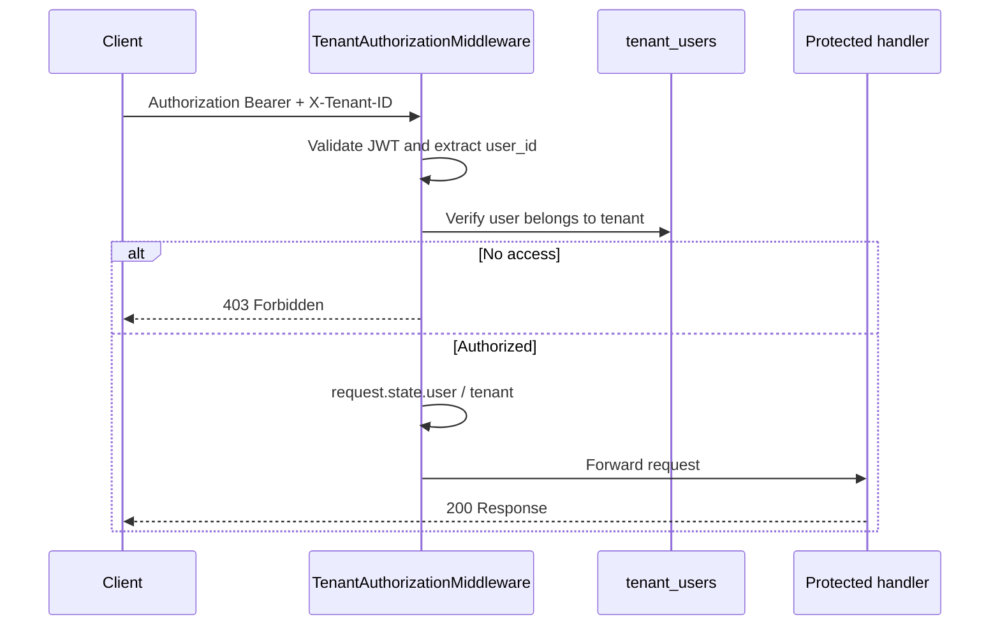

# Multi-Tenant Authorization

Protected APIs require **JWT authentication** and an **`X-Tenant-ID` header**. The server verifies membership in `tenant_users` and never trusts a tenant id from the request body or query string.

## Flow



## Public routes (no tenant middleware)

- `/auth/*`
- `/api/v1/health`
- `/docs`, `/redoc`, `/openapi.json`

## JWT-only routes (no `X-Tenant-ID`)

- `GET /me/context` — tenant resolved from JWT `tenant_id` claim only

## Headers

| Header | Required | Description |
|--------|----------|-------------|
| `Authorization` | Yes | `Bearer <access_token>` |
| `X-Tenant-ID` | Yes (protected routes) | UUID of the PG business tenant |

## Roles and permissions (RBAC)

Three roles exist in `tenant_users.role`:

| Role | Value | Description |
|------|-------|-------------|
| Super Admin | `super_admin` | Full access within a tenant (assign manually in DB for now) |
| Owner | `owner` | PG business owner — full access |
| Manager | `manager` | Day-to-day staff — limited write access |

Permission matrix:

| Permission | Super Admin | Owner | Manager |
|------------|:-----------:|:-----:|:-------:|
| `manage_flats` | Yes | Yes | No |
| `manage_rooms` | Yes | Yes | No |
| `manage_beds` | Yes | Yes | Yes |
| `manage_residents` | Yes | Yes | Yes |
| `manage_payments` | Yes | Yes | Yes |

Permissions are resolved in [`app/schemas/tenant_context.py`](../app/schemas/tenant_context.py) and enforced in the **service layer** via [`app/services/permissions.py`](../app/services/permissions.py).

## GET /me/context

Returns the current user, tenant branding, and permissions. No `X-Tenant-ID` header needed.

```http
GET /me/context
Authorization: Bearer <access_token>
```

Example response:

```json
{
  "user": {
    "id": "uuid",
    "name": "Owner Name",
    "email": "owner@example.com"
  },
  "tenant": {
    "id": "uuid",
    "name": "Demo PG",
    "logo_url": null,
    "primary_color": "#2563EB",
    "secondary_color": "#1E40AF",
    "is_demo": true,
    "subscription_status": "trial"
  },
  "permissions": {
    "manage_flats": true,
    "manage_rooms": true,
    "manage_beds": true,
    "manage_residents": true,
    "manage_payments": true
  }
}
```

The frontend should use `permissions` to show or hide UI actions (create flat, edit room, etc.).

## Example: login then call protected API

```http
POST /auth/login
Content-Type: application/json

{
  "email": "owner@example.com",
  "password": "password123"
}
```

Response:

```json
{
  "access_token": "eyJ...",
  "refresh_token": "eyJ...",
  "token_type": "bearer",
  "expires_in": 3600,
  "user": {
    "id": "uuid",
    "email": "owner@example.com",
    "full_name": "Owner Name"
  },
  "tenant_id": "uuid"
}
```

```http
GET /api/v1/examples/tenant-scope
Authorization: Bearer <access_token>
X-Tenant-ID: <tenant_id>
```

```json
{
  "message": "Authorized for tenant-scoped access",
  "user_id": "...",
  "user_email": "owner@example.com",
  "tenant_id": "...",
  "tenant_name": "Demo PG"
}
```

## Service-layer permission enforcement

Write operations check permissions inside services, not in routers:

```python
# app/services/flat_service.py
async def create_flat(self, data: FlatCreate) -> FlatResponse:
    require_permission(self.role, "manage_flats")
    ...
```

If the user's role lacks permission, the service raises `ForbiddenError` (HTTP 403).

## FastAPI dependency injection

Use injected dependencies on any protected route:

```python
from app.api.deps import CurrentTenant, CurrentUser, CurrentMembership

@router.get("/flats")
async def list_flats(
    user: CurrentUser,
    tenant: CurrentTenant,
    membership: CurrentMembership,
):
    ...
```

Available dependencies:

| Dependency | Type | Source |
|------------|------|--------|
| `CurrentUser` | `User` | JWT `sub` + DB |
| `CurrentTenant` | `Tenant` | `X-Tenant-ID` + `tenant_users` |
| `CurrentMembership` | `TenantUser` | `tenant_users` row |
| `CurrentUserId` | `UUID` | JWT `sub` |
| `CurrentTenantId` | `UUID` | `X-Tenant-ID` |
| `AuthorizedContextDep` | `AuthorizedContext` | Full auth context |

## Error responses

| Situation | Status | `error_code` |
|-----------|--------|--------------|
| Missing / invalid JWT | 401 | `unauthorized` |
| Missing `X-Tenant-ID` | 403 | `forbidden` |
| User not in tenant | 403 | `forbidden` |
| Inactive user / tenant | 403 | `forbidden` |
| Insufficient role permission | 403 | `forbidden` |

```json
{
  "detail": "Insufficient permissions to manage flats",
  "error_code": "forbidden"
}
```

## Implementing a new protected route

1. Add the route under `/api/v1/...` (not under `/auth`).
2. Create or extend a service that calls `require_permission()` for write operations.
3. Inject `AuthorizedContextDep` in the service factory to pass the user's role.
4. Ensure clients send both `Authorization` and `X-Tenant-ID`.
5. Use `tenant.id` for all tenant-scoped queries — never read tenant id from the body.

Example route: [`app/api/v1/examples.py`](../app/api/v1/examples.py)
