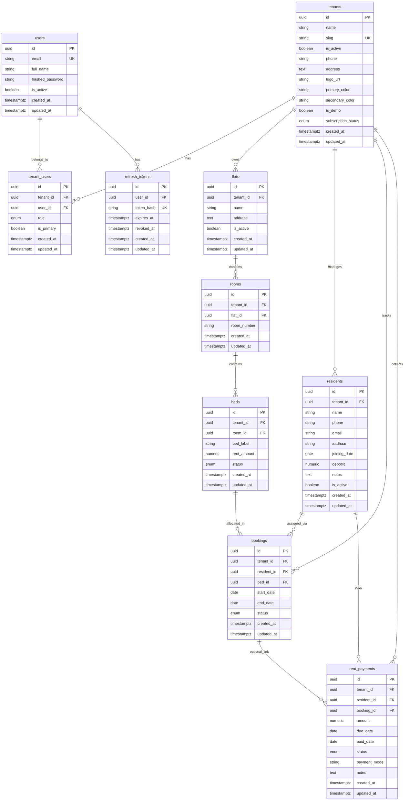

# PG Management — Database ERD

## Overview

The schema uses a **shared PostgreSQL database** with row-level multi-tenancy. Every business table (except `users` and `refresh_tokens`) is scoped to a `tenants` row representing a **PG business**.

Platform users (`users`) can belong to **multiple PG businesses** through `tenant_users`, supporting **multiple owners per tenant**.

## Entity Relationship Diagram



## Domain Hierarchy

```
Tenant (PG Business)
├── TenantUser → User (super_admin / owner / manager)
├── Flat (property)
│   └── Room
│       └── Bed
├── Resident (occupant)
│   ├── Booking → Bed
│   └── RentPayment
└── Booking / RentPayment (tenant-scoped)
```

## Roles

`tenant_users.role` values:

| Value | Role |
|-------|------|
| `super_admin` | Super Admin — full access (assign manually for now) |
| `owner` | Owner — full access |
| `manager` | Manager — limited write access |

## Key Relationships

| From | To | Cardinality | Notes |
|------|-----|-------------|-------|
| `tenants` | `tenant_users` | 1:N | Multiple members per PG business |
| `users` | `tenant_users` | 1:N | One user can manage multiple PG businesses |
| `users` | `refresh_tokens` | 1:N | Hashed refresh tokens for auth |
| `tenants` | `flats` | 1:N | A PG business can operate multiple properties |
| `flats` | `rooms` | 1:N | Unique `(flat_id, room_number)` |
| `rooms` | `beds` | 1:N | Unique `(room_id, bed_label)` |
| `residents` | `bookings` | 1:N | Tracks bed allocation history |
| `beds` | `bookings` | 1:N | Only one `active` booking per bed (enforced in service layer) |
| `residents` | `rent_payments` | 1:N | Rent ledger per resident |
| `bookings` | `rent_payments` | 1:N | Optional link to a specific stay |

## API status

| Table | API routes |
|-------|------------|
| `tenants`, `users`, `tenant_users` | Via auth and `/me/context` |
| `flats`, `rooms`, `beds`, `residents`, `rent_payments`, `bookings` | API at `/api/v1/*` |
| `refresh_tokens` | Internal — used by auth service |

## Indexes & Constraints

- **UUID primary keys** on all tables
- **`created_at` / `updated_at`** on all tables
- **Tenant isolation**: `tenant_id` FK + index on all tenant-scoped tables
- **Uniques**:
  - `tenants.slug`
  - `users.email`
  - `tenant_users (tenant_id, user_id)`
  - `refresh_tokens.token_hash`
  - `rooms (flat_id, room_number)`
  - `beds (room_id, bed_label)`
  - `residents (tenant_id, phone)`
- **Composite indexes**:
  - `bookings (tenant_id, status)`
  - `bookings (bed_id, status)`
  - `rent_payments (tenant_id, due_date)`
  - `rent_payments (tenant_id, status)`

## Naming Notes

| Backend model | Frontend type | Meaning |
|---------------|---------------|---------|
| `Tenant` | — | PG business / SaaS account |
| `Resident` | `Tenant` | Person staying in the PG |
| `Flat` | `Flat` | Property / building |
| `RentPayment` | `Payment` | Monthly rent record |

## Migrations

Apply with:

```powershell
alembic upgrade head
```

| Migration | Description |
|-----------|-------------|
| `001_initial_tenant_user` | Base `tenants` + `users` |
| `002_pg_domain_models` | `tenant_users` refactor + full domain schema |
| `003_refresh_tokens` | `refresh_tokens` table for JWT refresh |
| `004_tenant_branding` | Tenant logo, colors, `is_demo`, `subscription_status` |
| `005_role_rename` | Rename `staff` → `manager`; add `super_admin` role value |
