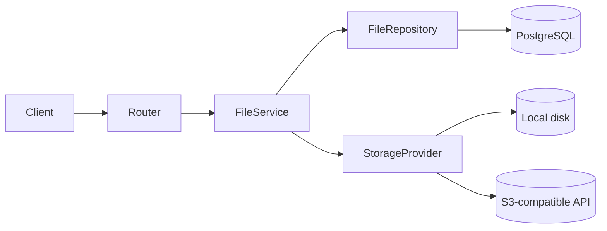

# File Storage

Cloud-agnostic file upload module with a pluggable storage provider layer.

## Overview

Files are tracked in PostgreSQL (`stored_files`) and binary content lives in object storage selected at runtime via `STORAGE_PROVIDER`.



## Storage providers

| Provider | Class | Use case |
|----------|-------|----------|
| `local` (default) | `LocalStorageProvider` | Local development |
| `s3` | `S3StorageProvider` | Production; works with AWS S3, MinIO, and other S3-compatible services |

Both implement the `StorageProvider` abstraction in [`app/storage/base.py`](../app/storage/base.py). No AWS-specific logic is hardcoded — S3 settings are fully configurable through environment variables.

## Configuration

| Variable | Default | Description |
|----------|---------|-------------|
| `STORAGE_PROVIDER` | `local` | `local` or `s3` |
| `LOCAL_STORAGE_PATH` | `./uploads` | Directory for local storage |
| `LOCAL_STORAGE_PUBLIC_BASE_URL` | `http://localhost:8000` | Base URL embedded in local presigned URLs |
| `STORAGE_PRESIGNED_URL_EXPIRES_SECONDS` | `3600` | Upload/download URL lifetime (60–86400) |
| `STORAGE_SIGNING_KEY` | JWT secret | HMAC key for local presigned URLs (use a separate value in production) |
| `MAX_UPLOAD_BYTES` | `10485760` | Maximum upload size (10 MB default) |
| `S3_BUCKET_NAME` | — | Required when `STORAGE_PROVIDER=s3` |
| `S3_REGION` | — | Required when `STORAGE_PROVIDER=s3` |
| `S3_ENDPOINT_URL` | — | Optional custom endpoint (MinIO, etc.) |
| `S3_ACCESS_KEY_ID` | — | Required when `STORAGE_PROVIDER=s3` |
| `S3_SECRET_ACCESS_KEY` | — | Required when `STORAGE_PROVIDER=s3` |

Switch providers by changing `STORAGE_PROVIDER` and restarting the app. The active provider is injected through FastAPI dependencies (`StorageProviderDep`).

## Allowed content types

Upload URL requests are limited to:

- `application/pdf`
- `image/jpeg`, `image/png`, `image/webp`
- `application/msword`
- `application/vnd.openxmlformats-officedocument.wordprocessingml.document`

## Upload flow

### 1. Request presigned upload URL

```http
POST /api/v1/files/upload-url
Authorization: Bearer <token>
X-Tenant-ID: <uuid>

{
  "filename": "aadhaar.pdf",
  "content_type": "application/pdf"
}
```

Response (201):

```json
{
  "file_id": "550e8400-e29b-41d4-a716-446655440000",
  "upload_url": "https://...",
  "method": "PUT",
  "headers": { "Content-Type": "application/pdf" },
  "storage_key": "tenant-uuid/file-uuid/aadhaar.pdf",
  "expires_at": "2026-06-20T12:00:00Z"
}
```

Requires `manage_files` permission (owners, managers, super admins).

### 2. Upload bytes directly to storage

**S3 provider:** `PUT` the file to `upload_url` with the returned headers, then call confirm:

```http
POST /api/v1/files/{file_id}/confirm
Authorization: Bearer <token>
X-Tenant-ID: <uuid>
```

**Local provider:** `PUT` the file to the returned `upload_url` (routes to `PUT /api/v1/files/{file_id}/content?expires=...&signature=...`). No JWT is required when valid signed query parameters are present.

### 3. List or get files

```http
GET /api/v1/files?page=1&page_size=20
Authorization: Bearer <token>
X-Tenant-ID: <uuid>
```

Uploaded files include a time-limited `download_url` in each item.

## Signed local file access

Local presigned URLs are validated by `SignedFileAccessMiddleware` before the request reaches tenant JWT middleware. Valid signed URLs:

- Do **not** require `Authorization` or `X-Tenant-ID`
- Bind to `file_id`, `storage_key`, and expiry via HMAC (`STORAGE_SIGNING_KEY`)
- Set tenant context automatically from the `stored_files` row

Authenticated users may also access `/files/{file_id}/content` with JWT + `X-Tenant-ID` (requires `manage_files`).

## Local helper routes

When `STORAGE_PROVIDER=local`:

| Method | Path | Auth | Purpose |
|--------|------|------|---------|
| PUT | `/api/v1/files/{file_id}/content` | Signed URL or JWT | Upload file bytes |
| GET | `/api/v1/files/{file_id}/content` | Signed URL or JWT | Download file bytes |

When `STORAGE_PROVIDER=s3`, clients upload/download directly against the S3-compatible endpoint. Use `POST /files/{file_id}/confirm` after upload.

## Dependency injection

```python
from app.storage.deps import StorageProviderDep

def get_file_service(..., storage: StorageProviderDep) -> FileService:
    return FileService(..., storage)
```

The factory in [`app/storage/factory.py`](../app/storage/factory.py) reads settings and returns the configured provider.

## Database

See [`DATABASE_ERD.md`](DATABASE_ERD.md) — `stored_files` table with tenant scoping and `pending` / `uploaded` status.
