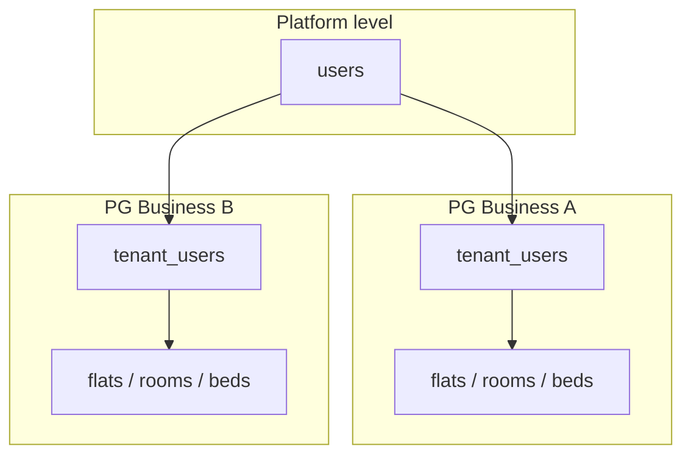

# Multi-Tenancy

The PG Management app is **multi-tenant**: many PG businesses share one PostgreSQL database. Data is isolated by `tenant_id` on every business table.

## Model



- A **user** is a platform account (email + password)
- A **tenant** is a PG business
- **tenant_users** links users to tenants with a role (Super Admin, Owner, or Manager)
- One user can belong to multiple PG businesses

## Tenant isolation rules

1. Every tenant-owned table has a `tenant_id` column
2. Protected routes require `X-Tenant-ID` header matching a valid membership
3. Repositories auto-filter queries by `tenant_id`
4. Never read `tenant_id` from request body or query string for authorization
5. Never trust client-provided tenant information without verifying `tenant_users`

## Required headers (protected routes)

| Header | Value |
|--------|-------|
| `Authorization` | `Bearer <access_token>` |
| `X-Tenant-ID` | UUID of the PG business |

The middleware verifies the user belongs to that tenant before the request reaches the router.

## TenantScopedMixin

Defined in [`app/db/base.py`](../app/db/base.py). All business models (flats, rooms, beds, residents, bookings, etc.) include:

```python
tenant_id: UUID  # FK to tenants.id, indexed
```

## Auto-set tenant_id on insert

When a new tenant-scoped record is created:

1. Middleware sets the current tenant in a `ContextVar` ([`tenant_context.py`](../app/middleware/tenant_context.py))
2. A SQLAlchemy `before_flush` hook reads that value
3. If `tenant_id` is not set on a new object, it is filled automatically

This prevents accidental cross-tenant inserts when the context is set correctly.

## BaseRepository tenant filter

[`app/repositories/base.py`](../app/repositories/base.py) applies tenant filtering on every query when `tenant_id` is provided:

```python
stmt = stmt.where(self.model.tenant_id == self.tenant_id)
```

Domain repositories (flats, rooms, beds, residents) are constructed with the authenticated tenant ID. A user can only read or write data for the tenant in their `X-Tenant-ID` header.

## Route types

| Type | `X-Tenant-ID` | Tenant source |
|------|---------------|---------------|
| Public (`/auth/*`, `/health`) | Not needed | — |
| JWT-only (`GET /me/context`) | Not used | JWT `tenant_id` claim |
| Protected (`/api/v1/*`) | Required | Header, verified against `tenant_users` |

Route classification lives in [`app/core/paths.py`](../app/core/paths.py).

## Demo tenant

On signup, users are assigned to the demo tenant (`DEMO_TENANT_SLUG`, default `"demo"`). The demo tenant has `is_demo=true` in the database. This lets new users try the app without creating a real PG business.

## Frontend guidance

1. After login, store `tenant_id` from the token response
2. Send `X-Tenant-ID: <tenant_id>` on every protected API call
3. Use `GET /me/context` to load user info, tenant branding, and permissions
4. Do not send `tenant_id` in create/update request bodies for authorization

See [AUTHORIZATION_EXAMPLES.md](AUTHORIZATION_EXAMPLES.md) for HTTP examples and [DATABASE_ERD.md](DATABASE_ERD.md) for the full schema.
